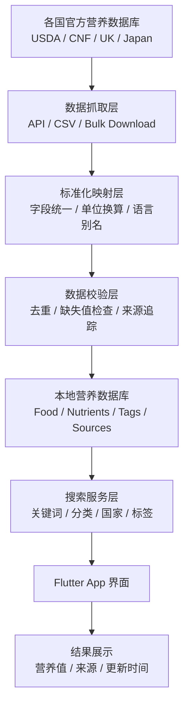

# DataHookClaws

DataHookClaws 是一个用 Dart / Flutter 构建的营养数据采集与搜索 App，目标是把各国权威食品营养数据库的数据抓取、标准化、入库，并通过统一搜索接口返回营养信息。

## 项目流程图



## 当前实现

- 已用 SQLite 替换内存仓储，导入的数据会持久化保存在本地。
- 已实现 `SyncFoodCatalogUseCase` + importer 抽象，支持按官方来源分别执行导入。
- 已把官方来源目录升级为“国家 -> 官方数据库”分层模型，区分 `Integrated` 与 `Cataloged` 状态。
- 已新增标准化映射层，把 importer 的原始记录统一映射为内部 `FoodItem` 模型。
- 已新增导入日志表，记录每次导入的来源、时间、状态、查询词和导入条数。
- 已接入真实 USDA FoodData Central API importer。
- 已接入基于官方 CSV 结构的 Canadian Nutrient File importer。
- 已接入基于官方 Excel 工作簿的 UK CoFID importer。
- 已接入基于官方 Excel 工作簿的 Japan MEXT 2023 importer。
- 已接入基于官方 Excel 工作簿的 Switzerland importer。
- 已接入基于官方 Excel 工作簿的 France CIQUAL 2025 importer。
- 已接入基于官方 Frida spreadsheet 的 Denmark importer。
- 已接入基于官方多文件 Excel 包的 Australia AFCD importer。
- 已新增官方数据抓取准备层。UK / Japan 在未提供本地路径时会自动抓取官方工作簿。
- Switzerland 在未提供本地路径时会自动抓取官方 Excel 工作簿。
- France 在未提供本地路径时会自动抓取官方 CIQUAL 2025 Excel 工作簿。
- Denmark Frida 当前需要用户通过官方表单获取 spreadsheet 后手动提供本地路径。
- Australia 在未提供本地路径时会自动抓取官方 AFCD 数据文件目录。
- 首页现在可以直接配置导入参数、执行导入、查看导入历史，并搜索本地数据库。

## 当前接入方式

- `USDA FoodData Central`
  - 官方文档：<https://fdc.nal.usda.gov/api-guide>
  - 需要 FoodData Central / data.gov API key
  - 当前通过 `/fdc/v1/foods/search` 导入 Foundation / SR Legacy 结果

- `Canadian Nutrient File`
  - 官方说明：<https://www.canada.ca/en/health-canada/services/food-nutrition/healthy-eating/nutrient-data.html>
  - 当前可自动下载官方 CSV zip 并自动解压，也支持手动提供已解压目录路径
  - 目录中至少需要 `Food name`、`Nutrient amount`、`Nutrient name` 三类 CSV

- `UK CoFID`
  - 官方说明：<https://www.gov.uk/government/publications/composition-of-foods-integrated-dataset-cofid>
  - 当前可自动抓取官方 CoFID `.xlsx` 文件，也支持手动提供本地文件路径
  - 当前 importer 会汇总 `1.3 Proximates`、`1.4 Inorganics`、`1.5 Vitamins`

- `Japan Standard Tables of Food Composition`
  - 官方说明：<https://www.mext.go.jp/a_menu/syokuhinseibun/mext_00001.html>
  - 当前可自动抓取官方主表 `.xlsx` 文件，也支持手动提供本地文件路径
  - 当前 importer 读取 2023 主表各食品群工作表，并依据成分识别子定位核心营养列

- `Swiss Food Composition Database`
  - 官方说明：<https://naehrwertdaten.ch/en/downloads/>
  - 当前可自动抓取官方 `.xlsx` 文件，也支持手动提供本地文件路径
  - 当前 importer 读取 `Generic Foods` 与 `Branded foods` 工作表，并提取核心营养列

- `France CIQUAL 2025`
  - 官方说明：<https://ciqual.anses.fr/cms/en/2025-anses-ciqual-table>
  - 当前可自动抓取官方英文版 `.xlsx` 工作簿，也支持手动提供本地文件路径
  - 当前 importer 读取 `food composition` 工作表，并提取核心营养列

- `Denmark Frida`
  - 官方说明：<https://frida.fooddata.dk/?lang=en>
  - 当前支持导入通过官方 Frida 表单获取的 spreadsheet，本轮不绕过邮件表单做自动下载
  - 当前 importer 支持 Frida 的 Food / Parameter / Content 规范化表结构，也支持宽表结构

- `Australian Food Composition Database`
  - 官方说明：<https://www.foodstandards.gov.au/science-data/food-nutrient-databases/afcd/data-files>
  - 当前可自动抓取官方 AFCD Excel 数据文件，也支持手动提供已下载目录
  - 当前 importer 组合 `Food details`、`Nutrient profiles` 与 `Nutrient details`

## 已编目国家官方来源

- `New Zealand`
  - FOODfiles：<https://foodcomposition.co.nz/foodfiles/>
  - 当前已为 MSI 安装包建立发现入口，但官方 Terms of Use 要求数据以原始且未修改形式呈现，这与当前标准化/归并/导出流水线冲突，因此 importer 暂时阻塞
- `Finland`
  - Fineli Open Data：<https://fineli.fi/fineli/en/avoin-data>
- `Germany`
  - BLS：<https://www.blsdb.de/>
- `Spain`
  - BEDCA：<https://www.bedca.net/>
- `Italy`
  - CREA Food Composition Tables：<https://www.crea.gov.it/en/-/tabella-di-composizione-degli-alimenti>

这些来源目前已进入国家级官方目录，但还没有全部完成 importer 和解析映射。这样做的目的是先把来源治理、分层展示和后续扩展边界固定下来。

## 当前架构

- `importers/`
  - 只负责读取官方源文件或 API，并输出原始记录。
- `domain/normalization/`
  - 负责统一类别、营养素名称、单位和标签，再映射为内部 `FoodItem`。
- `data/`
  - 负责 SQLite 持久化、搜索、国家级来源目录和导入日志。
- `tool/`
  - 负责 importer 扩展队列、脚手架模板，以及 Codex 自动化消费的本地机器可读配置。

## 后续建议

1. 继续按队列扩展来源，优先 Germany，再处理 Italy / Spain / Finland。New Zealand 目前因许可条件与当前架构冲突而阻塞。
2. 增加高级搜索：营养素范围筛选、排序、收藏和最近搜索。
3. 为导入日志增加筛选和重试入口。
4. 为官方工作簿导入增加文件选择器，而不是手输路径。

## 运行

```bash
"/Users/zhouzhenghang/Applications/Flutter SDK/flutter/bin/flutter" pub get
"/Users/zhouzhenghang/Applications/Flutter SDK/flutter/bin/flutter" run
```
