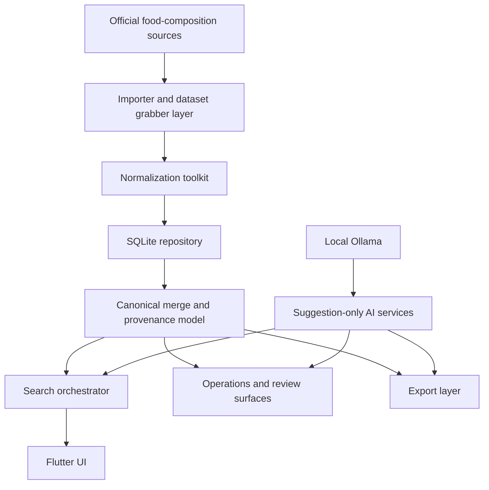

# DataHookClaws

[](https://github.com/albertzhzhou-droid/DataHookClaws/actions/workflows/flutter-ci.yml)

DataHookClaws is a Flutter/Dart application for building a local-first nutrition database from official national food-composition sources. It is designed to search local data first, fetch authoritative source data on demand, normalize records into a provenance-first SQLite model, and keep every merge/export decision auditable.

This repository contains the application code and importer logic. It does not bundle a complete world nutrition database, and it should not be treated as an official nutrition data product until source-license governance is completed for each data source.

## Core Capabilities

- Local-first food search backed by SQLite.
- Official-source importers for USDA, Canada CNF, UK CoFID, Japan MEXT, Switzerland, France CIQUAL, Denmark Frida, Australia AFCD, Germany BLS, and Italy CREA.
- Manifest-driven dataset preparation for supported downloadable workbooks/packages.
- Controlled foreground fetch and session-local background enrichment.
- Provenance-first persistence with canonical foods, source records, nutrient observations, aliases, artifacts, fetch jobs, and AI suggestion logs.
- Deterministic canonical merge with source-level merge audit and candidate explanations.
- Manual data-governance writeback for merge, split, and override review workflows.
- Operations page for fetch jobs, artifacts, importer diagnostics, budgets, data-quality review, export history, and manual governance logs.
- Settings page for Ollama, model budget, storage budget, export directory, and source enablement.
- Local JSON, CSV, and SQLite snapshot export.
- Cautious local-AI assistance for query expansion, routing suggestions, merge-review explanation, and export summaries. AI output is logged and is never authoritative nutrition data.
- GitHub Actions CI for `flutter analyze`, `flutter test`, targeted importer tests, and Web build artifact generation.

## Architecture Overview



Important architectural boundaries:

- Official source records remain the source of truth.
- `foods` is a fast canonical snapshot, not the authoritative provenance layer.
- AI may suggest, summarize, or explain, but it must not write nutrient facts or decide canonical truth.
- New sources stay manual-only until source metadata explicitly permits automatic routing.
- Advanced nutrient filtering is local-only and does not trigger remote fetching.

## Implemented Official Sources

| Source | Importer status | Notes |
| --- | --- | --- |
| USDA FoodData Central | Integrated | Uses the FoodData Central search API. Requires an API key. |
| Canadian Nutrient File | Integrated | Supports automatic official CSV zip download/unpack or a local extracted directory. |
| UK CoFID | Integrated | Supports automatic official workbook download or a local `.xlsx` file. |
| Japan MEXT 2023 | Integrated | Supports automatic official workbook download or a local `.xlsx` file. |
| Swiss Food Composition Database | Integrated | Supports official Excel workbook import. |
| France CIQUAL 2025 | Integrated | Supports official English workbook import. |
| Denmark Frida | Integrated | Supports spreadsheets obtained through the official Frida form. Automatic download is intentionally disabled. |
| Australia AFCD | Integrated | Supports multi-file Excel directory import. |
| Germany BLS 4.0 | Integrated | Supports the official BLS 4.0 workbook. |
| Italy CREA / AlimentiNUTrizione | Integrated | Imports from the official web portal search/detail pages. |
| New Zealand FOODfiles | Blocked | Current terms require original and unmodified presentation, which conflicts with this normalization/merge/export pipeline. |
| Spain BEDCA | Blocked | Requires a separate web/API and license review before normalized importer/export use. |
| Finland Fineli | Blocked | Official open-data path is currently unavailable for package/license verification. |

## Local Setup

Prerequisites:

- Flutter SDK
- Dart SDK through Flutter
- Platform toolchain for the target you want to run
- Optional: Ollama with a local model such as `llama3`

Install dependencies:

```bash
flutter pub get
```

Run the app:

```bash
flutter run
```

Run validation:

```bash
flutter analyze
flutter test
flutter test test/domain/source_importers_test.dart test/domain/it_crea_importer_test.dart
flutter build web
```

## Ollama Configuration

Default local AI settings:

- Endpoint: `http://127.0.0.1:11434`
- Model: `llama3`
- Timeout: `3s`
- Max tokens: `256`
- Max calls per minute: `6`

If Ollama is unavailable, over budget, or times out, the application falls back to deterministic behavior. Search, review, and export workflows continue without blocking.

## Export And Release Notes

DataHookClaws can export local search results as JSON/CSV and copy the current SQLite database as a local snapshot. Exported files are produced from the user's local database and may contain source-derived material, so source terms still apply.

Release packaging notes are in [docs/release_packaging.md](docs/release_packaging.md). CI builds a Web artifact, but GitHub Pages and formal public data-product release are intentionally not enabled.

## Governance And License Boundaries

The code in this repository is licensed under the MIT License. Official nutrition datasets, source web pages, trademarks, and database rights remain governed by their respective source owners and terms. See [NOTICE](NOTICE) for source and data-use notes.

This project is not medical advice, nutrition advice, or an official government data publication. Always verify critical nutrition values against the original source.

## Development Documentation

- [Project plan](docs/PROJECT_PLAN.md)
- [Release packaging notes](docs/release_packaging.md)
- [Agent operating context](AGENT.md)
