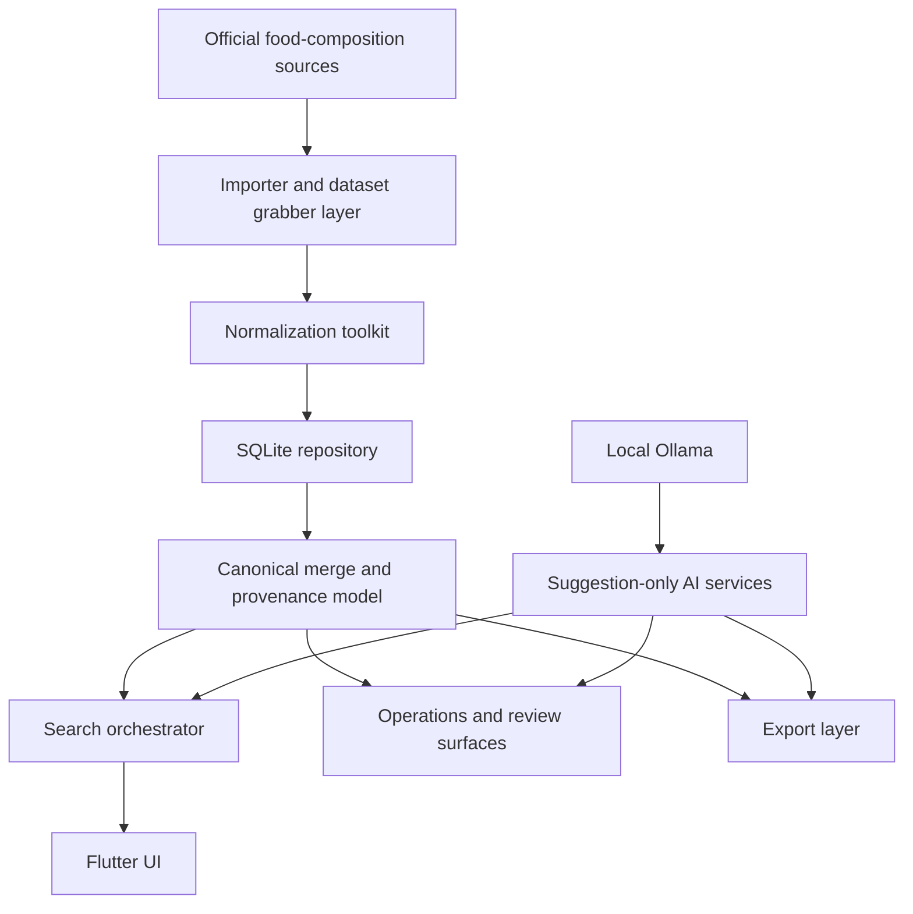

# DataHookClaws

[](https://github.com/albertzhzhou-droid/DataHookClaws/actions/workflows/flutter-ci.yml)

DataHookClaws is a Flutter/Dart application for building a local-first nutrition database from official national food-composition sources. It is designed to search local data first, fetch authoritative source data on demand, normalize records into a provenance-first SQLite model, and keep every merge/export decision auditable.

This repository contains the application code and importer logic. It does not bundle a complete world nutrition database, and it should not be treated as an official nutrition data product until source-license governance is completed for each data source.

## Core Capabilities

- Local-first food search backed by SQLite.
- Official-source importers for USDA, Canada CNF, UK CoFID, Japan MEXT, Switzerland, France CIQUAL, Denmark Frida, Australia AFCD, Germany BLS, and Italy CREA.
- Manifest-driven dataset preparation for supported downloadable workbooks/packages.
- Controlled foreground fetch and session-local background enrichment.
- Provenance-first persistence with canonical foods, source records, nutrient observations, aliases, artifacts, fetch jobs, and AI suggestion logs.
- Deterministic canonical merge with source-level merge audit and candidate explanations.
- Manual data-governance writeback for merge, split, and override review workflows.
- Operations page for fetch jobs, artifacts, importer diagnostics, budgets, data-quality review, export history, and manual governance logs.
- Settings page for Ollama, model budget, storage budget, export directory, and source enablement.
- Local JSON, CSV, and SQLite snapshot export.
- Cautious local-AI assistance for query expansion, routing suggestions, merge-review explanation, and export summaries. AI output is logged and is never authoritative nutrition data.
- GitHub Actions CI for `flutter analyze`, `flutter test`, targeted importer tests, and Web build artifact generation.

## Architecture Overview


```mermaid
flowchart TD
    A["Official food-composition sources"] --> B["Importer and dataset grabber layer"]
    B --> C["Normalization toolkit"]
    C --> D["SQLite repository"]
    D --> E["Canonical merge and provenance model"]
    E --> F["Search orchestrator"]
    F --> G["Flutter UI"]
    E --> H["Operations and review surfaces"]
    E --> I["Export layer"]
    J["Local Ollama"] --> K["Suggestion-only AI services"]
    K --> F
    K --> H
    K --> I
```

Important architectural boundaries:

- Official source records remain the source of truth.
- `foods` is a fast canonical snapshot, not the authoritative provenance layer.
- AI may suggest, summarize, or explain, but it must not write nutrient facts or decide canonical truth.
- New sources stay manual-only until source metadata explicitly permits automatic routing.
- Advanced nutrient filtering is local-only and does not trigger remote fetching.

## Implemented Official Sources

| Source | Importer status | Notes |
| --- | --- | --- |
| USDA FoodData Central | Integrated | Uses the FoodData Central search API. Requires an API key. |
| Canadian Nutrient File | Integrated | Supports automatic official CSV zip download/unpack or a local extracted directory. |
| UK CoFID | Integrated | Supports automatic official workbook download or a local `.xlsx` file. |
| Japan MEXT 2023 | Integrated | Supports automatic official workbook download or a local `.xlsx` file. |
| Swiss Food Composition Database | Integrated | Supports official Excel workbook import. |
| France CIQUAL 2025 | Integrated | Supports official English workbook import. |
| Denmark Frida | Integrated | Supports spreadsheets obtained through the official Frida form. Automatic download is intentionally disabled. |
| Australia AFCD | Integrated | Supports multi-file Excel directory import. |
| Germany BLS 4.0 | Integrated | Supports the official BLS 4.0 workbook. |
| Italy CREA / AlimentiNUTrizione | Integrated | Imports from the official web portal search/detail pages. |
| New Zealand FOODfiles | Blocked | Current terms require original and unmodified presentation, which conflicts with this normalization/merge/export pipeline. |
| Spain BEDCA | Blocked | Requires a separate web/API and license review before normalized importer/export use. |
| Finland Fineli | Blocked | Official open-data path is currently unavailable for package/license verification. |

## Local Setup

Prerequisites:

- Flutter SDK
- Dart SDK through Flutter
- Platform toolchain for the target you want to run
- Optional: Ollama with a local model such as `llama3`

Install dependencies:

```bash
flutter pub get
```

Run the app:

```bash
flutter run
```

Run validation:

```bash
./tool/ci_checks.sh
```

By default in local/non-CI mode, the Flutter and compare regression checks
are soft-skipped when the environment cannot run them (for example, without
network for hooks or when Flutter SDK cache updates are unavailable).
To force strict behavior locally, run:

```bash
DHC_DART_BIN="/path/to/your/flutter/bin/cache/dart-sdk/bin/dart" \
DHC_FLUTTER_BIN="/path/to/your/flutter/bin/flutter" \
DHC_FORCE_DART_CHECKS=true ./tool/ci_checks.sh
```

This variable pair enforces strictness only for the Dart-based checks
(`check_compare_replay_draft_cleanup.dart`, `check_compare_unit_normalization.dart`,
`check_compare_accessibility.dart`, parser/trend/funnel scripts). Flutter stages
(`flutter analyze`, `flutter test`, and build) are still soft-skipped locally
unless `DHC_FORCE_FLUTTER_CHECKS=true` (or CI mode).

For `check_compare_unit_normalization.dart`, you can also pass a custom fixture path:

```bash
DHC_COMPARE_UNIT_NORMALIZATION_FIXTURE="tool/fixtures/compare_unit_normalization_cases.json" \
DHC_FORCE_DART_CHECKS=true ./tool/ci_checks.sh
```

If unset, the script defaults to `tool/fixtures/compare_unit_normalization_cases.json`
both locally and in CI. A missing, unreadable, malformed, or zero-case fixture
emits a diagnostic on stderr and falls back to the built-in regression cases;
non-object array entries are treated as malformed rather than silently ignored.
GitHub Actions can override the path through the repository variable
`DHC_COMPARE_UNIT_NORMALIZATION_FIXTURE`; the workflow explicitly maps that
variable into the job environment before applying the same default.

If you also want Flutter-only command strictness locally (instead of soft-skip),
set:

```bash
DHC_DART_BIN="/path/to/your/flutter/bin/cache/dart-sdk/bin/dart" \
DHC_FLUTTER_BIN="/path/to/your/flutter/bin/flutter" \
DHC_FORCE_FLUTTER_CHECKS=true ./tool/ci_checks.sh
```

CI runs are strict by default.

Compare accessibility regression checks additionally consume a snapshot specification at
`docs/compare_replay_accessibility_snapshot_template.json` to validate no-draft/
manual-rebuild compare replay paths and urgent warning phrasing.

### Compare accessibility CI contract

The field-level contract for this CI path is documented in
[docs/compare_replay_accessibility_ci_contract.md](docs/compare_replay_accessibility_ci_contract.md),
including report block markers, JSON schema, parser outputs, and failure budgets.

### Compare accessibility CI report parsing

The compare accessibility gate now emits machine-readable summary lines:

- `COMPARE_REPLAY_A11Y_TEMPLATE_SUMMARY_JSON=...`
- `COMPARE_REPLAY_A11Y_TEMPLATE_REPORT_START/END`

CI parses this output with `tool/parse_compare_accessibility_report.dart` and prints:

- `COMPARE_REPLAY_A11Y_CI_METRICS ...`
- `COMPARE_REPLAY_A11Y_PARSED_JSON=...`

You can also run the parser locally for manual smoke checks:

```bash
# Use an inner SDK dart binary in write-restricted CI/offline environments (recommended):
export DART_BIN="/path/to/your/flutter/bin/cache/dart-sdk/bin/dart"
HOME=/tmp/dhc_dart_checks_home DART_SUPPRESS_ANALYTICS=true "$DART_BIN" tool/check_compare_accessibility.dart | tee /tmp/compare_replay_accessibility_check.log
HOME=/tmp/dhc_dart_checks_home DART_SUPPRESS_ANALYTICS=true "$DART_BIN" tool/parse_compare_accessibility_report.dart /tmp/compare_replay_accessibility_check.log
```

For CI governance trending, keep parsed JSON outputs and run:

```bash
"$DART_BIN" tool/analyze_compare_accessibility_trends.dart /tmp/compare_replay_accessibility_log1.log /tmp/compare_replay_accessibility_log2.log --window-runs 7
"$DART_BIN" tool/analyze_compare_accessibility_trends.dart /tmp/compare_replay_accessibility_log1.log /tmp/compare_replay_accessibility_log2.log --window-days 7
```

Optional trend alerting (supports both `alerts` and `rateTrend`):

```bash
export DHC_A11Y_TREND_MAX_SCHEMA_MISMATCH=0
export DHC_A11Y_TREND_MAX_UNKNOWN_SEVERITY=0
export DHC_A11Y_TREND_MIN_PASS_RATE=0.98
export DHC_A11Y_TREND_MIN_PHRASE_SUCCESS_RATE=0.98
export DHC_A11Y_TREND_MIN_SEMANTICS_RATE=0.98
export DHC_A11Y_TREND_MIN_LIVEREGION_RATE=0.98
export DHC_A11Y_TREND_MAX_PASS_RATE_DROP=0.02
export DHC_A11Y_TREND_MAX_PHRASE_SUCCESS_RATE_DROP=0.02
export DHC_A11Y_TREND_MAX_SEMANTICS_RATE_DROP=0.02
export DHC_A11Y_TREND_MAX_LIVEREGION_RATE_DROP=0.02
export DHC_A11Y_TREND_MAX_CONSECUTIVE_DROPS=3
export DHC_A11Y_TREND_RECURRENCE_WINDOW=2
export DHC_A11Y_TREND_MAX_RECURRENCE_COUNT=0
export DHC_A11Y_TREND_MAX_ABSENCE_RUNS=999
export DHC_A11Y_TREND_FAIL_ON_ALERTS=true
```

Optional trend history + denoise:

```bash
export DHC_A11Y_TREND_HISTORY_FILE=/tmp/compare_replay_accessibility_trend_history.jsonl
export DHC_A11Y_TREND_HISTORY_MAX_ENTRIES=50
export DHC_A11Y_TREND_TREND_NOISE_WINDOW=2
export DHC_A11Y_TREND_RECURRENCE_WINDOW=2
export DHC_A11Y_TREND_MAX_RECURRENCE_COUNT=0
export DHC_A11Y_TREND_MAX_ABSENCE_RUNS=999
```

Run with history persistence:

```bash
"$DART_BIN" run tool/analyze_compare_accessibility_trends.dart \
  /tmp/compare_replay_accessibility_check.log \
  --window-runs 7 \
  --history-file /tmp/compare_replay_accessibility_trend_history.jsonl \
  --history-max-entries 50 \
  --trend-noise-window 2 \
  --output-json
```

Generate trend dashboard artifacts (daily/weekly digest and stable alert candidates):

```bash
"$DART_BIN" run tool/build_compare_accessibility_trend_digest.dart \
  /tmp/compare_replay_accessibility_trend_history.jsonl \
  --scope compare_replay_accessibility \
  --daily-limit 14 \
  --weekly-limit 8 \
  --regression-window 2 \
  --output-json
```

Optional dashboard env overrides:

```bash
export DHC_A11Y_TREND_DASHBOARD_DAILY_LIMIT=14
export DHC_A11Y_TREND_DASHBOARD_WEEKLY_LIMIT=8
export DHC_A11Y_TREND_DASHBOARD_REGRESSION_WINDOW=2
```

Optional strict thresholds (for CI-like behavior):

```bash
export DHC_A11Y_REPORT_STRICT=true
export DHC_A11Y_MAX_CASES_FAILED=0
export DHC_A11Y_MAX_PHRASE_MISSING=0
export DHC_A11Y_MAX_SEMANTIC_FAIL=0
export DHC_A11Y_MAX_LIVEREGION_FAIL=0
export DHC_A11Y_MAX_UNKNOWN_SEVERITY_BUCKET=0
```

When `DHC_A11Y_REPORT_STRICT` is true, any threshold violation exits non-zero and fails the step.

Trend-check can run from the same local parse log after parser output:

```bash
"$DART_BIN" run tool/analyze_compare_accessibility_trends.dart \
  /tmp/compare_replay_accessibility_check.log \
  --window-runs 7 \
  --output-json
```

For offline or hook-constrained environments, you can validate the full chain via AOT using your local Flutter SDK dart binary:

```bash
export FLUTTER_DART_BIN="/path/to/flutter/bin/cache/dart-sdk/bin/dart"
HOME=/private/tmp/dhc_dart_home_test DART_SUPPRESS_ANALYTICS=true \
  "$FLUTTER_DART_BIN" compile exe tool/check_compare_accessibility.dart -o /tmp/check_compare_accessibility
HOME=/private/tmp/dhc_dart_home_test DART_SUPPRESS_ANALYTICS=true \
  "$FLUTTER_DART_BIN" compile exe tool/parse_compare_accessibility_report.dart -o /tmp/parse_report
HOME=/private/tmp/dhc_dart_home_test DART_SUPPRESS_ANALYTICS=true \
  "$FLUTTER_DART_BIN" compile exe tool/analyze_compare_accessibility_trends.dart -o /tmp/analyze_trend
HOME=/private/tmp/dhc_dart_home_test DART_SUPPRESS_ANALYTICS=true \
  "$FLUTTER_DART_BIN" compile exe tool/build_compare_accessibility_trend_digest.dart -o /tmp/build_digest
/tmp/check_compare_accessibility | tee /tmp/compare_replay_accessibility_check.log
/tmp/parse_report /tmp/compare_replay_accessibility_check.log | tee /tmp/compare_replay_accessibility_parsed.log
/tmp/analyze_trend /tmp/compare_replay_accessibility_parsed.log --window-runs 7 --output-json
/tmp/build_digest /tmp/compare_replay_accessibility_trend_history.jsonl --scope compare_replay_accessibility --output-json
```

In CI, trend alerts are treated as failing when `CI=true`; for non-CI runs, add
`DHC_A11Y_TREND_FAIL_ON_ALERTS=true` to enforce local strictness.

## Ollama Configuration

Default local AI settings:

- Endpoint: `http://127.0.0.1:11434`
- Model: `llama3`
- Timeout: `3s`
- Max tokens: `256`
- Max calls per minute: `6`

If Ollama is unavailable, over budget, or times out, the application falls back to deterministic behavior. Search, review, and export workflows continue without blocking.

## Export And Release Notes

DataHookClaws can export local search results as JSON/CSV and copy the current SQLite database as a local snapshot. Exported files are produced from the user's local database and may contain source-derived material, so source terms still apply.

Release packaging notes are in [docs/release_packaging.md](docs/release_packaging.md). CI builds a Web artifact, but GitHub Pages and formal public data-product release are intentionally not enabled.

## Governance And License Boundaries

The code in this repository is licensed under the MIT License. Official nutrition datasets, source web pages, trademarks, and database rights remain governed by their respective source owners and terms. See [NOTICE](NOTICE) for source and data-use notes.

This project is not medical advice, nutrition advice, or an official government data publication. Always verify critical nutrition values against the original source.

## Development Documentation

- [Project plan](docs/PROJECT_PLAN.md)
- [Compare replay accessibility trend dashboard script](tool/build_compare_accessibility_trend_digest.dart)
- [Release packaging notes](docs/release_packaging.md)
- [Agent operating context](AGENT.md)
- [Compare replay accessibility CI contract](docs/compare_replay_accessibility_ci_contract.md)
