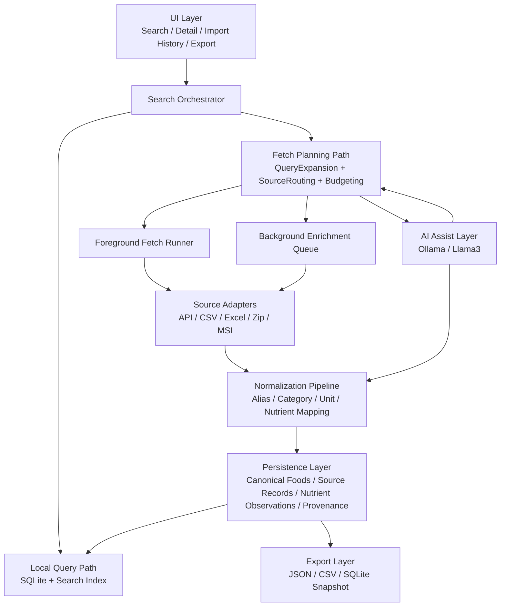
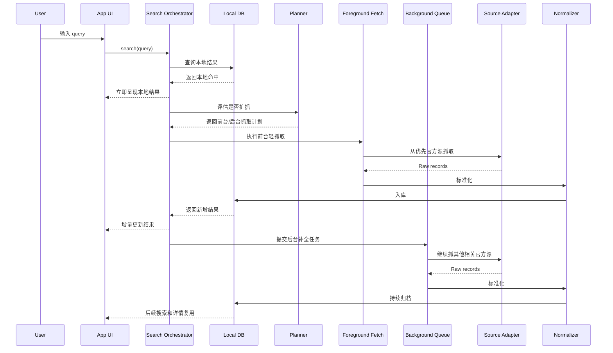

# DataHookClaws 生产流程架构说明书与执行计划

## 1. 文档目的

这份文档定义 DataHookClaws 的目标生产架构，重点解决四件事：

1. 让项目始终处于可控结构下运行。
2. 把性能、存储、模型推理和抓取成本压到最低，但不牺牲功能性。
3. 把“打开即用 + 主动抓取 + 持续归档 + 随时导出”落成一个可执行系统。
4. 明确 AI 在流程中的职责边界，避免它污染权威事实层。

---

## 2. 总体产品定义

DataHookClaws 不是一个一次性塞满所有国家数据的静态数据库。

它的正确产品定义是：

`一个本地优先、按需抓取、持续补全、来源可追踪、随时可导出的权威食品营养数据库客户端。`

用户使用流程应当是：

1. 打开 App，立即可用。
2. 搜索一个提示词，先返回本地已有结果。
3. 若本地结果不足，前台立即抓取“最容易抓、最可能命中”的官方源并快速呈现。
4. 用户浏览结果时，后台继续围绕该提示词做渐进式权威补全。
5. 新抓到的数据进入本地数据库并可持续复用。
6. 用户随时可以导出当前结果、某国家数据、某主题数据或全库快照。

---

## 3. 顶层设计原则

### 3.1 可控性优先

- 所有抓取、标准化、入库、导出都必须经过明确模块。
- 禁止把业务逻辑散落在 UI、importer 或临时脚本里。
- 所有 AI 输出只能作为建议或排序依据，不能直接成为事实源。
- 所有跨库合并必须保留 provenance。

### 3.2 本地优先

- 搜索先查本地库。
- 本地库是用户可感知的主要数据面。
- 网络抓取是增量增强，不是每次查询的硬前置。

### 3.3 成本最小化

- 先抓 API 和小型结构化源，再抓大包。
- 先抓最可能命中的国家源，再扩展到其他国家。
- 只在必要时调用本地 LLM。
- 原始包、结构化记录、搜索索引、导出快照分层存储。

### 3.4 功能不妥协

- 不因为性能压力而删除 provenance。
- 不因为包体压力而丢失核心标准化结果。
- 不因为模型成本而放弃查询扩展和智能补全，只是调整调用时机与预算。

---

## 4. 非功能目标

### 4.1 启动与交互

- 冷启动不依赖联网。
- 搜索输入响应应优先使用本地索引。
- 前台抓取必须分阶段反馈状态，避免“卡住但用户不知道在做什么”。

### 4.2 资源约束

- 存储：采用预算上限和冷热分层管理。
- CPU：大文件解析与 AI 推理进入后台任务队列。
- 内存：避免一次性载入整包全部工作簿或大型 CSV。
- 网络：按优先级、按 query、按国家逐步抓取。

### 4.3 可维护性

- 每个国家来源必须以独立 importer/grabber 注册。
- 每个国家来源必须有版本、入口、包类型、许可说明。
- 每条导入链路必须有日志与失败原因。

---

## 5. 目标能力范围

### 5.1 必须具备

- 本地数据库搜索
- 按 query 前台即时抓取
- 后台持续补全
- 标准化映射
- 来源追踪
- 导出
- AI 查询扩展与来源路由
- 存储预算和抓取预算控制

### 5.2 明确不做

- 不让 AI 生成营养数值
- 不让 AI 直接覆盖权威字段
- 不把所有国家的全量数据库预打包进安装包
- 不把后台抓取设计成无限制全网扫描

---

## 6. 目标系统架构

---

## 7. 分层说明

## 7.1 UI Layer

职责：

- 搜索入口
- 结果列表与详情页
- 当前抓取状态反馈
- 导入历史
- 数据导出入口
- 资源使用提示

约束：

- UI 不直接调 importer。
- UI 只调用 orchestrator / service。

## 7.2 Search Orchestrator

职责：

- 搜索总控
- 先查本地，再决定是否前台抓取
- 触发后台补全
- 聚合结果和状态

输入：

- query
- 用户上下文
- 当前本地命中情况
- 设备资源状态

输出：

- first paint 结果
- foreground fetch 结果
- background enrichment 任务

## 7.3 Fetch Planning Layer

子模块：

- `QueryExpansionService`
- `SourceRoutingService`
- `FetchBudgetPlanner`
- `ModelBudgetController`
- `StorageBudgetManager`

职责：

- 生成 query alias 和多语言扩展
- 决定先抓哪个源
- 决定抓多少
- 决定是否值得用 AI
- 决定抓到的数据怎么存

## 7.4 Source Adapters

职责：

- 对接官方 API、Excel、CSV、Zip、MSI 等不同发布形态
- 输出统一 `RawFoodRecord`

约束：

- 只做来源读取
- 不做业务路由
- 不做 UI 状态管理
- 不做最终事实合并

## 7.5 Normalization Pipeline

职责：

- 文本清洗
- alias key 标准化
- nutrient label 对齐
- 单位换算
- 分类映射
- 标签清洗
- 候选冲突标记

原则：

- 规则层决定最终规范字段
- AI 只提供候选映射建议

## 7.6 Persistence Layer

目标不是只存一个 `FoodItem` 表，而是分层存储。

建议模型：

- `canonical_food`
  - 规范化食物主体
- `source_record`
  - 各国来源原始记录索引
- `nutrient_observation`
  - 每条来源提供的营养观测
- `food_alias`
  - 别名和 query 扩展词
- `fetch_job`
  - 抓取任务状态
- `import_log`
  - 导入日志
- `dataset_artifact`
  - 原始包、解压目录、版本信息
- `export_snapshot`
  - 导出快照
- `ai_suggestion_log`
  - AI 的 query 扩展、映射建议、去重建议

## 7.7 Export Layer

必须支持：

- 当前搜索结果导出 JSON
- 当前搜索结果导出 CSV
- 某国家数据导出
- 全库 SQLite 快照导出
- 指定时间点快照导出

---

## 8. AI 的职责边界

AI 适合做：

- 查询扩展
- 多语言别名生成
- 来源路由排序
- 候选映射建议
- 去重打分
- 用户可读摘要

AI 不适合做：

- 直接生成营养数值
- 直接写入最终事实字段
- 无 provenance 地覆盖冲突记录

推荐原则：

`AI 决定搜什么、先搜哪、哪些像同一个东西、如何给人看；规则层决定营养值到底是什么。`

---

## 9. 性能与资源控制架构

## 9.1 StorageBudgetManager

职责：

- 定义存储上限
- 管理冷热分层
- 清理原始抓取包
- 保留核心结构化数据

存储层级：

- `Hot`
  - 常搜 query、近期浏览、热门国家源
- `Warm`
  - 保留结构化数据，不保留完整原始包
- `Cold`
  - 仅保留 provenance 和最小索引

## 9.2 FetchBudgetPlanner

职责：

- 前台抓取预算
- 后台抓取预算
- 单 query 最大来源数
- 单来源最大记录数
- 大包源延迟策略

优先级建议：

1. API 源
2. 已下载结构化包
3. 可快速下载的小文件源
4. 需要解压的大包源
5. 需要复杂解析的安装包源

## 9.3 ModelBudgetController

职责：

- 判断是否调用 Ollama
- 选择模型大小
- 控制 token / 调用频率
- 低电量或忙碌状态下降级

建议：

- `query expansion` 使用小模型
- `record clustering` 使用中等模型
- `summary generation` 在后台运行

## 9.4 Search Index Strategy

要求：

- 本地索引必须独立于抓取链路存在
- 搜索首先命中 SQLite / 本地索引
- 营养字段、标签、别名要可索引

---

## 10. 生产流程说明

---

## 11. 当前项目与目标架构的差距

当前已有：

- SQLite 本地持久化
- importer 抽象
- official dataset grabber
- normalization toolkit
- search index
- API DTO
- import logs
- 多国家来源目录

当前缺失：

- `SearchOrchestrator`
- `ForegroundFetchRunner`
- `BackgroundEnrichmentQueue`
- `QueryExpansionService`
- `SourceRoutingService`
- `StorageBudgetManager`
- `FetchBudgetPlanner`
- `ModelBudgetController`
- provenance-first 数据表
- export snapshot 层
- AI suggestion log

---

## 12. 直接执行落实计划书

## Phase 0：架构固化

目标：

- 把后续所有实现都绑在统一架构上，停止无计划扩张。

执行项：

1. 新增 `SearchOrchestrator` 接口与默认实现
2. 新增 `FetchBudgetPlanner`
3. 新增 `StorageBudgetManager`
4. 新增 `ModelBudgetController`
5. 新增 `QueryExpansionService` 与 `SourceRoutingService` 抽象
6. 在 UI 中把搜索入口改为只调用 orchestrator

验收标准：

- UI 不再直接依赖 repository + syncUseCase 组合进行搜索增强
- 搜索流程可区分“本地结果”“前台抓取结果”“后台补全中”

## Phase 1：数据模型重构

目标：

- 从单体 `FoodItem` 视图过渡到“规范食物 + 来源观测 + provenance”结构。

执行项：

1. SQLite schema 升级：
   - `canonical_food`
   - `source_record`
   - `nutrient_observation`
   - `food_alias`
   - `dataset_artifact`
   - `fetch_job`
   - `ai_suggestion_log`
2. 保留现有 `foods` 兼容层或做迁移脚本
3. repository 拆成读模型与写模型

验收标准：

- 同一食物可挂载多个国家来源观测
- 同一 nutrient 冲突可保留多来源而不互相覆盖

## Phase 2：前台即时抓取

目标：

- 搜索时自动抓取“低成本高收益”官方源。

执行项：

1. 实现 `ForegroundFetchRunner`
2. 先接入：
   - USDA
   - Canada CNF
   - UK CoFID
   - Japan MEXT
3. 定义 query 到 importer 的 routing 策略
4. 查询状态反馈：
   - local hit
   - fetching
   - archived

验收标准：

- 用户输入 query 时，即使本地为空，也能看到前台轻抓结果
- 结果会自动落库

## Phase 3：后台持续补全

目标：

- 用户浏览期间持续扩充同主题权威数据。

执行项：

1. 实现 `BackgroundEnrichmentQueue`
2. 实现任务优先级、重试、取消
3. 以 query 为中心扩展 alias
4. 在详情页停留或结果页停留后触发补全

验收标准：

- 后台任务不阻塞 UI
- 补全结果会进入数据库，下一次搜索直接命中

## Phase 4：AI 接入

目标：

- 用本地 Ollama / Llama3 提升搜索质量和抓取命中率。

执行项：

1. 新增 `OllamaClient`
2. 新增 `QueryExpansionService`
3. 新增 `SourceRoutingService`
4. 新增 `RecordMatchScorer`
5. 新增 `MappingSuggestionService`
6. AI 输出写入 `ai_suggestion_log`

验收标准：

- query 扩展可被审计
- AI 不直接写最终事实值

## Phase 5：预算与性能治理

目标：

- 在功能不减的前提下，把资源占用降到最小。

执行项：

1. 实现 `StorageBudgetManager`
2. 实现原始包冷热分层
3. 实现 `FetchBudgetPlanner`
4. 实现 `ModelBudgetController`
5. 为大包解析增加分块处理

验收标准：

- 用户可设存储预算
- 后台抓取和 AI 调用有明确上限
- 旧包可清理，结构化数据仍保留

## Phase 6：导出与交付

目标：

- 把数据库真正变成随时可用、可输出的资产。

执行项：

1. 新增 `ExportService`
2. 支持 JSON / CSV / SQLite snapshot
3. 支持按 query / 国家 / 来源 / 时间导出
4. 新增导出历史

验收标准：

- 用户可在 App 内发起导出
- 导出的结构可被其他系统直接消费

---

## 13. 优先级排序

如果只允许先做最关键的三步，顺序应当是：

1. `SearchOrchestrator + FetchBudgetPlanner + UI 状态改造`
2. `provenance-first 数据模型升级`
3. `BackgroundEnrichmentQueue + Ollama QueryExpansion`

原因：

- 没有 orchestrator，主动抓取会继续散乱生长。
- 没有 provenance-first schema，后面多源合并一定失控。
- 没有后台补全和 query expansion，产品差异化不成立。

---

## 14. 立即执行版本

下一次迭代直接进入以下落地清单：

1. 增加 `SearchOrchestrator`
2. 增加 `SearchSessionState`
3. 增加 `ForegroundFetchRunner`
4. 增加 `FetchBudgetPlanner`
5. 扩展 SQLite schema，加入 `fetch_job`、`dataset_artifact`
6. UI 增加搜索状态区：
   - local
   - fetching
   - enriching
   - archived
7. 接入本地 `OllamaClient`
8. 先实现 `QueryExpansionService`

---

## 15. 结论

这个项目的正确演化方向不是“继续累加 importer”，而是：

`先建立可控的主动抓取与归档总线，再把国家数据库一个个挂上去。`

这样做的结果是：

- 结构可控
- 性能成本可控
- AI 可控
- 多国家扩展可控
- 用户体验稳定
- 数据可沉淀、可追踪、可导出
